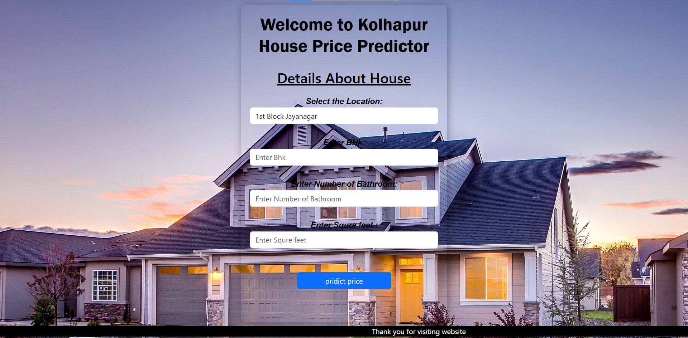

# 🏠 House Price Prediction using Python Flask Framework

This project is a web-based machine learning application that predicts house prices based on various input features like area, number of bedrooms, location, etc. It is built using Python, Flask, and a trained regression model.

## 📌 Features

- 📊 Predicts house prices using a trained ML model
- 🌐 User-friendly web interface built with HTML and Flask
- 📁 Modular structure with clear separation of concerns
- ⚙️ Easy to run locally

## 🚀 Tech Stack

- 💻 **Frontend**: HTML, CSS (Bootstrap)
- 🧠 **ML Model**: Scikit-learn (Linear Regression / Random Forest)
- 🔙 **Backend**: Python, Flask
- 🧪 **Libraries**: pandas, numpy, scikit-learn, pickle

## 🧠 ML Workflow

1. Data Preprocessing
2. Feature Selection
3. Model Training
4. Model Serialization using `pickle`
5. Model Integration with Flask for prediction

## 📷 UI Preview


## 🛠️ How to Run Locally

```bash
# Clone the repository
git clone https://github.com/ShubhamP510/house-price-prediction-flask.git
cd house-price-prediction-flask

# Create a virtual environment (optional)
python -m venv venv
source venv/bin/activate  # On Windows: venv\Scripts\activate

# Install dependencies
pip install -r requirements.txt

# Run the app
python app.py
